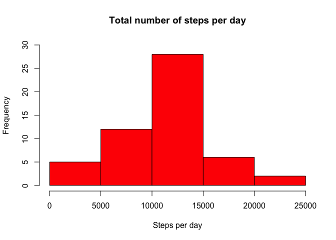
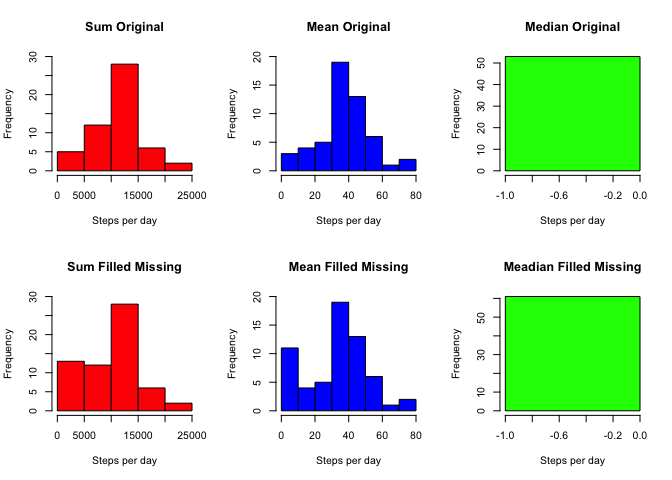

# Reproducible Research: Peer Assessment 1


## Loading and preprocessing the data

1. Unzip and loading data

```r
file <- unz('./activity.zip', 'activity.csv')
data <- read.csv2(file, sep=",")
```

2. Removing NA values

```r
data_formatted <- data[complete.cases(data),]
```
  
## What is mean total number of steps taken per day?
1. Histogram of the total number of steps taken each day

```r
#install.packages('plyr')
library(plyr)
data_formatted_grouped <- ddply(data_formatted,~date,summarise
                                ,sum_steps=sum(steps)
                                ,mean_steps=mean(steps)
                                ,median_steps=median(steps))
hist(data_formatted_grouped$sum_steps
     ,main='Total number of steps per day'
     ,xlab='Steps per day', ylim=c(0,30), col='Red')
```

 

2. Report the mean and median total number of steps taken per day

```r
#install.packages('xtable')
library(xtable)
print(type="html", xtable(data_formatted_grouped[,c('date','mean_steps','median_steps')]))
```

<!-- html table generated in R 3.1.1 by xtable 1.7-4 package -->
<!-- Sun Oct 19 21:15:08 2014 -->
<table border=1>
<tr> <th>  </th> <th> date </th> <th> mean_steps </th> <th> median_steps </th>  </tr>
  <tr> <td align="right"> 1 </td> <td> 2012-10-02 </td> <td align="right"> 0.44 </td> <td align="right"> 0.00 </td> </tr>
  <tr> <td align="right"> 2 </td> <td> 2012-10-03 </td> <td align="right"> 39.42 </td> <td align="right"> 0.00 </td> </tr>
  <tr> <td align="right"> 3 </td> <td> 2012-10-04 </td> <td align="right"> 42.07 </td> <td align="right"> 0.00 </td> </tr>
  <tr> <td align="right"> 4 </td> <td> 2012-10-05 </td> <td align="right"> 46.16 </td> <td align="right"> 0.00 </td> </tr>
  <tr> <td align="right"> 5 </td> <td> 2012-10-06 </td> <td align="right"> 53.54 </td> <td align="right"> 0.00 </td> </tr>
  <tr> <td align="right"> 6 </td> <td> 2012-10-07 </td> <td align="right"> 38.25 </td> <td align="right"> 0.00 </td> </tr>
  <tr> <td align="right"> 7 </td> <td> 2012-10-09 </td> <td align="right"> 44.48 </td> <td align="right"> 0.00 </td> </tr>
  <tr> <td align="right"> 8 </td> <td> 2012-10-10 </td> <td align="right"> 34.38 </td> <td align="right"> 0.00 </td> </tr>
  <tr> <td align="right"> 9 </td> <td> 2012-10-11 </td> <td align="right"> 35.78 </td> <td align="right"> 0.00 </td> </tr>
  <tr> <td align="right"> 10 </td> <td> 2012-10-12 </td> <td align="right"> 60.35 </td> <td align="right"> 0.00 </td> </tr>
  <tr> <td align="right"> 11 </td> <td> 2012-10-13 </td> <td align="right"> 43.15 </td> <td align="right"> 0.00 </td> </tr>
  <tr> <td align="right"> 12 </td> <td> 2012-10-14 </td> <td align="right"> 52.42 </td> <td align="right"> 0.00 </td> </tr>
  <tr> <td align="right"> 13 </td> <td> 2012-10-15 </td> <td align="right"> 35.20 </td> <td align="right"> 0.00 </td> </tr>
  <tr> <td align="right"> 14 </td> <td> 2012-10-16 </td> <td align="right"> 52.38 </td> <td align="right"> 0.00 </td> </tr>
  <tr> <td align="right"> 15 </td> <td> 2012-10-17 </td> <td align="right"> 46.71 </td> <td align="right"> 0.00 </td> </tr>
  <tr> <td align="right"> 16 </td> <td> 2012-10-18 </td> <td align="right"> 34.92 </td> <td align="right"> 0.00 </td> </tr>
  <tr> <td align="right"> 17 </td> <td> 2012-10-19 </td> <td align="right"> 41.07 </td> <td align="right"> 0.00 </td> </tr>
  <tr> <td align="right"> 18 </td> <td> 2012-10-20 </td> <td align="right"> 36.09 </td> <td align="right"> 0.00 </td> </tr>
  <tr> <td align="right"> 19 </td> <td> 2012-10-21 </td> <td align="right"> 30.63 </td> <td align="right"> 0.00 </td> </tr>
  <tr> <td align="right"> 20 </td> <td> 2012-10-22 </td> <td align="right"> 46.74 </td> <td align="right"> 0.00 </td> </tr>
  <tr> <td align="right"> 21 </td> <td> 2012-10-23 </td> <td align="right"> 30.97 </td> <td align="right"> 0.00 </td> </tr>
  <tr> <td align="right"> 22 </td> <td> 2012-10-24 </td> <td align="right"> 29.01 </td> <td align="right"> 0.00 </td> </tr>
  <tr> <td align="right"> 23 </td> <td> 2012-10-25 </td> <td align="right"> 8.65 </td> <td align="right"> 0.00 </td> </tr>
  <tr> <td align="right"> 24 </td> <td> 2012-10-26 </td> <td align="right"> 23.53 </td> <td align="right"> 0.00 </td> </tr>
  <tr> <td align="right"> 25 </td> <td> 2012-10-27 </td> <td align="right"> 35.14 </td> <td align="right"> 0.00 </td> </tr>
  <tr> <td align="right"> 26 </td> <td> 2012-10-28 </td> <td align="right"> 39.78 </td> <td align="right"> 0.00 </td> </tr>
  <tr> <td align="right"> 27 </td> <td> 2012-10-29 </td> <td align="right"> 17.42 </td> <td align="right"> 0.00 </td> </tr>
  <tr> <td align="right"> 28 </td> <td> 2012-10-30 </td> <td align="right"> 34.09 </td> <td align="right"> 0.00 </td> </tr>
  <tr> <td align="right"> 29 </td> <td> 2012-10-31 </td> <td align="right"> 53.52 </td> <td align="right"> 0.00 </td> </tr>
  <tr> <td align="right"> 30 </td> <td> 2012-11-02 </td> <td align="right"> 36.81 </td> <td align="right"> 0.00 </td> </tr>
  <tr> <td align="right"> 31 </td> <td> 2012-11-03 </td> <td align="right"> 36.70 </td> <td align="right"> 0.00 </td> </tr>
  <tr> <td align="right"> 32 </td> <td> 2012-11-05 </td> <td align="right"> 36.25 </td> <td align="right"> 0.00 </td> </tr>
  <tr> <td align="right"> 33 </td> <td> 2012-11-06 </td> <td align="right"> 28.94 </td> <td align="right"> 0.00 </td> </tr>
  <tr> <td align="right"> 34 </td> <td> 2012-11-07 </td> <td align="right"> 44.73 </td> <td align="right"> 0.00 </td> </tr>
  <tr> <td align="right"> 35 </td> <td> 2012-11-08 </td> <td align="right"> 11.18 </td> <td align="right"> 0.00 </td> </tr>
  <tr> <td align="right"> 36 </td> <td> 2012-11-11 </td> <td align="right"> 43.78 </td> <td align="right"> 0.00 </td> </tr>
  <tr> <td align="right"> 37 </td> <td> 2012-11-12 </td> <td align="right"> 37.38 </td> <td align="right"> 0.00 </td> </tr>
  <tr> <td align="right"> 38 </td> <td> 2012-11-13 </td> <td align="right"> 25.47 </td> <td align="right"> 0.00 </td> </tr>
  <tr> <td align="right"> 39 </td> <td> 2012-11-15 </td> <td align="right"> 0.14 </td> <td align="right"> 0.00 </td> </tr>
  <tr> <td align="right"> 40 </td> <td> 2012-11-16 </td> <td align="right"> 18.89 </td> <td align="right"> 0.00 </td> </tr>
  <tr> <td align="right"> 41 </td> <td> 2012-11-17 </td> <td align="right"> 49.79 </td> <td align="right"> 0.00 </td> </tr>
  <tr> <td align="right"> 42 </td> <td> 2012-11-18 </td> <td align="right"> 52.47 </td> <td align="right"> 0.00 </td> </tr>
  <tr> <td align="right"> 43 </td> <td> 2012-11-19 </td> <td align="right"> 30.70 </td> <td align="right"> 0.00 </td> </tr>
  <tr> <td align="right"> 44 </td> <td> 2012-11-20 </td> <td align="right"> 15.53 </td> <td align="right"> 0.00 </td> </tr>
  <tr> <td align="right"> 45 </td> <td> 2012-11-21 </td> <td align="right"> 44.40 </td> <td align="right"> 0.00 </td> </tr>
  <tr> <td align="right"> 46 </td> <td> 2012-11-22 </td> <td align="right"> 70.93 </td> <td align="right"> 0.00 </td> </tr>
  <tr> <td align="right"> 47 </td> <td> 2012-11-23 </td> <td align="right"> 73.59 </td> <td align="right"> 0.00 </td> </tr>
  <tr> <td align="right"> 48 </td> <td> 2012-11-24 </td> <td align="right"> 50.27 </td> <td align="right"> 0.00 </td> </tr>
  <tr> <td align="right"> 49 </td> <td> 2012-11-25 </td> <td align="right"> 41.09 </td> <td align="right"> 0.00 </td> </tr>
  <tr> <td align="right"> 50 </td> <td> 2012-11-26 </td> <td align="right"> 38.76 </td> <td align="right"> 0.00 </td> </tr>
  <tr> <td align="right"> 51 </td> <td> 2012-11-27 </td> <td align="right"> 47.38 </td> <td align="right"> 0.00 </td> </tr>
  <tr> <td align="right"> 52 </td> <td> 2012-11-28 </td> <td align="right"> 35.36 </td> <td align="right"> 0.00 </td> </tr>
  <tr> <td align="right"> 53 </td> <td> 2012-11-29 </td> <td align="right"> 24.47 </td> <td align="right"> 0.00 </td> </tr>
   </table>

## What is the average daily activity pattern?
1. Time series plot (i.e. type = "l") of the 5-minute interval (x-axis) and the average number of steps taken, averaged across all days (y-axis)

```r
plot(data_formatted_grouped$date
     ,data_formatted_grouped$mean_steps
     ,type='n'
     ,main='Averaged steps per day x Date'
     ,xlab='Date'
     ,ylab='Steps number')
lines(data_formatted_grouped$date
      ,data_formatted_grouped$mean_steps
      ,type='l') 
```

 

2. Which 5-minute interval, on average across all the days in the dataset, contains the maximum number of steps?

```r
max_value <- max(data_formatted_grouped$mean_steps)
date_max_value <- as.character(data_formatted_grouped[data_formatted_grouped$mean_steps == max_value, ]$date)
```
On 2012-11-23 it was achieved the maximum number of steps.  

## Imputing missing values
1. Total number of missing values in the dataset (i.e. the total number of rows with NAs)

```r
total_row_numbers_missing <- nrow(data) - nrow(data_formatted)
```
There are 2304 rows missing values from the original dataset.

2. New dataset that is equal to the original dataset but with the missing data filled in.


```r
data_filled <- data
for(row in 1:nrow(data_filled)) {
    if(is.na(data_filled[row,]$steps)) {
        date <- data_filled[data_filled[row,]$date == data_filled$date, ]$date[1]
        steps_mean <- data_formatted_grouped[data_formatted_grouped$date == date,]$steps_mean
        if(!is.null(steps_mean)){
            data_filled[row,]$steps <- steps_mean
        } else {
            data_filled[row,]$steps <- 0
        }
    }
}

print('Head with first 25 rows:')
```

[1] "Head with first 25 rows:"

```r
print(type="html", xtable(data_filled[1:25,]))
```

<!-- html table generated in R 3.1.1 by xtable 1.7-4 package -->
<!-- Sun Oct 19 21:15:25 2014 -->
<table border=1>
<tr> <th>  </th> <th> steps </th> <th> date </th> <th> interval </th>  </tr>
  <tr> <td align="right"> 1 </td> <td align="right"> 0.00 </td> <td> 2012-10-01 </td> <td align="right">   0 </td> </tr>
  <tr> <td align="right"> 2 </td> <td align="right"> 0.00 </td> <td> 2012-10-01 </td> <td align="right">   5 </td> </tr>
  <tr> <td align="right"> 3 </td> <td align="right"> 0.00 </td> <td> 2012-10-01 </td> <td align="right">  10 </td> </tr>
  <tr> <td align="right"> 4 </td> <td align="right"> 0.00 </td> <td> 2012-10-01 </td> <td align="right">  15 </td> </tr>
  <tr> <td align="right"> 5 </td> <td align="right"> 0.00 </td> <td> 2012-10-01 </td> <td align="right">  20 </td> </tr>
  <tr> <td align="right"> 6 </td> <td align="right"> 0.00 </td> <td> 2012-10-01 </td> <td align="right">  25 </td> </tr>
  <tr> <td align="right"> 7 </td> <td align="right"> 0.00 </td> <td> 2012-10-01 </td> <td align="right">  30 </td> </tr>
  <tr> <td align="right"> 8 </td> <td align="right"> 0.00 </td> <td> 2012-10-01 </td> <td align="right">  35 </td> </tr>
  <tr> <td align="right"> 9 </td> <td align="right"> 0.00 </td> <td> 2012-10-01 </td> <td align="right">  40 </td> </tr>
  <tr> <td align="right"> 10 </td> <td align="right"> 0.00 </td> <td> 2012-10-01 </td> <td align="right">  45 </td> </tr>
  <tr> <td align="right"> 11 </td> <td align="right"> 0.00 </td> <td> 2012-10-01 </td> <td align="right">  50 </td> </tr>
  <tr> <td align="right"> 12 </td> <td align="right"> 0.00 </td> <td> 2012-10-01 </td> <td align="right">  55 </td> </tr>
  <tr> <td align="right"> 13 </td> <td align="right"> 0.00 </td> <td> 2012-10-01 </td> <td align="right"> 100 </td> </tr>
  <tr> <td align="right"> 14 </td> <td align="right"> 0.00 </td> <td> 2012-10-01 </td> <td align="right"> 105 </td> </tr>
  <tr> <td align="right"> 15 </td> <td align="right"> 0.00 </td> <td> 2012-10-01 </td> <td align="right"> 110 </td> </tr>
  <tr> <td align="right"> 16 </td> <td align="right"> 0.00 </td> <td> 2012-10-01 </td> <td align="right"> 115 </td> </tr>
  <tr> <td align="right"> 17 </td> <td align="right"> 0.00 </td> <td> 2012-10-01 </td> <td align="right"> 120 </td> </tr>
  <tr> <td align="right"> 18 </td> <td align="right"> 0.00 </td> <td> 2012-10-01 </td> <td align="right"> 125 </td> </tr>
  <tr> <td align="right"> 19 </td> <td align="right"> 0.00 </td> <td> 2012-10-01 </td> <td align="right"> 130 </td> </tr>
  <tr> <td align="right"> 20 </td> <td align="right"> 0.00 </td> <td> 2012-10-01 </td> <td align="right"> 135 </td> </tr>
  <tr> <td align="right"> 21 </td> <td align="right"> 0.00 </td> <td> 2012-10-01 </td> <td align="right"> 140 </td> </tr>
  <tr> <td align="right"> 22 </td> <td align="right"> 0.00 </td> <td> 2012-10-01 </td> <td align="right"> 145 </td> </tr>
  <tr> <td align="right"> 23 </td> <td align="right"> 0.00 </td> <td> 2012-10-01 </td> <td align="right"> 150 </td> </tr>
  <tr> <td align="right"> 24 </td> <td align="right"> 0.00 </td> <td> 2012-10-01 </td> <td align="right"> 155 </td> </tr>
  <tr> <td align="right"> 25 </td> <td align="right"> 0.00 </td> <td> 2012-10-01 </td> <td align="right"> 200 </td> </tr>
   </table>

3. Make a histogram of the total number of steps taken each day and Calculate and report the mean and median total number of steps taken per day. Do these values differ from the estimates from the first part of the assignment? What is the impact of imputing missing data on the estimates of the total daily number of steps?


```r
data_filled_grouped <- ddply(data_filled,~date,summarise
                             ,sum_steps=sum(steps)
                             ,mean_steps=mean(steps)
                             ,median_steps=median(steps, na.rm=TRUE))
par(mfrow=c(2,3))
hist(data_formatted_grouped$sum_steps
     ,main='Sum Original'
     ,xlab='Steps per day', ylim=c(0,30), col='Red')
hist(data_formatted_grouped$mean_steps
     ,main='Mean Original'
     ,xlab='Steps per day', ylim=c(0,20), col='Blue')
hist(data_formatted_grouped$median_steps
     ,main='Median Original'
     ,xlab='Steps per day', col='Green')
hist(data_filled_grouped$sum_steps
     ,main='Sum Filled Missing'
     ,xlab='Steps per day', ylim=c(0,30), col='Red')
hist(data_filled_grouped$mean_steps
     ,main='Mean Filled Missing'
     ,xlab='Steps per day', ylim=c(0,20), col='Blue')
hist(data_filled_grouped$median_steps
     ,main='Meadian Filled Missing'
     ,xlab='Steps per day', col='Green')
```

 

There are differences between the data with and without missing values. The shape tends to mantain, but frequency throught the sequence changed.

## Are there differences in activity patterns between weekdays and weekends?

1. New factor variable in the dataset with two levels – “weekday” and “weekend” indicating whether a given date is a weekday or weekend day.


```r
data_filled_grouped <- ddply(data_filled,~date,summarise
                             ,sum_steps=sum(steps)
                             ,mean_steps=mean(steps)
                             ,median_steps=median(steps))

data_filled_grouped$day <- weekdays(as.Date(as.character(data_filled_grouped$date)))
for(row in 1:nrow(data_filled_grouped)) {
    if(data_filled_grouped[row,]$day == 'Saturday' || data_filled_grouped[row,]$day == 'Sunday') {
        data_filled_grouped[row, ]$day <- 'Weekend'
    } else {
        data_filled_grouped[row, ]$day <- 'Weekday'
    }
}
data_filled_grouped$day <- factor(data_filled_grouped$day)
```

2. Panel plot containing a time series plot (i.e. type = "l") of the 5-minute interval (x-axis) and the average number of steps taken, averaged across all weekday days or weekend days (y-axis). The plot should look something like the following, which was creating using simulated data:

```r
par(mfrow=c(1,2))
date_formatted_grouped_weekdays <- data_filled_grouped[as.character(data_filled_grouped$day) == 'Weekday',]
plot(date_formatted_grouped_weekdays$date
     ,date_formatted_grouped_weekdays$mean_steps
     ,type='n'
     ,main='AVG Steps Weekdays'
     ,xlab='Date'
     ,ylab='Steps number')
lines(date_formatted_grouped_weekdays$date
      ,date_formatted_grouped_weekdays$mean_steps
      ,type='l') 

date_formatted_grouped_weekends <- data_filled_grouped[as.character(data_filled_grouped$day) == 'Weekend',]
plot(date_formatted_grouped_weekends$date
     ,date_formatted_grouped_weekends$mean_steps
     ,type='n'
     ,main='AVG Steps Weekends'
     ,xlab='Date'
     ,ylab='Steps number')
lines(date_formatted_grouped_weekends$date
      ,date_formatted_grouped_weekends$mean_steps
      ,type='l') 
```

 

Your plot will look different from the one above because you will be using the activity monitor data. Note that the above plot was made using the lattice system but you can make the same version of the plot using any plotting system you choose.
